[Source pdf](Bengio-2025.pdf)

# 📚 卡片清單

### 1. [通用AI代理](cards/Bengio-2025-001.md)
- **ID**: `Bengio-2025-001`
- **核心**: "The leading AI companies are increasingly focused on building generalist AI agents—systems that can autonomously plan, act, and pursue goals across almost all tasks that humans can perform."

### 2. [不受約束的AI代理帶來的風險](cards/Bengio-2025-002.md)
- **ID**: `Bengio-2025-002`
- **核心**: "Despite how useful these systems might be, unchecked AI agency poses significant risks to public safety and security, ranging from misuse by malicious actors to a potentially irreversible loss of human control."

### 3. [AI代理的欺騙行為](cards/Bengio-2025-003.md)
- **ID**: `Bengio-2025-003`
- **核心**: "Indeed, various scenarios and experiments have demonstrated the possibility of AI agents engaging in deception or pursuing goals that were not specified by human operators and that conflict with human interests, such as self-preservation."

### 4. [自我保存作為未對齊目標](cards/Bengio-2025-004.md)
- **ID**: `Bengio-2025-004`
- **核心**: "Indeed, various scenarios and experiments have demonstrated the possibility of AI agents engaging in deception or pursuing goals that were not specified by human operators and that conflict with human interests, such as self-preservation."

### 5. [AI發展中的預防原則](cards/Bengio-2025-005.md)
- **ID**: `Bengio-2025-005`
- **核心**: "Following the precautionary principle, we see a strong need for safer, yet still useful, alternatives to the current agency-driven trajectory."

### 6. [科學家AI：非代理式系統](cards/Bengio-2025-006.md)
- **ID**: `Bengio-2025-006`
- **核心**: "Accordingly, we propose as a core building block for further advances the development of a non-agentic AI system that is trustworthy and safe by design, which we call Scientist AI."

### 7. [科學家AI中的世界模型](cards/Bengio-2025-007.md)
- **ID**: `Bengio-2025-007`
- **核心**: "It comprises a world model that generates theories to explain data and a question-answering inference machine."

### 8. [科學家AI中的問答推斷機](cards/Bengio-2025-008.md)
- **ID**: `Bengio-2025-008`
- **核心**: "It comprises a world model that generates theories to explain data and a question-answering inference machine."

### 9. [明確的不確定性概念](cards/Bengio-2025-009.md)
- **ID**: `Bengio-2025-009`
- **核心**: "Both components operate with an explicit notion of uncertainty to mitigate the risks of over-confident predictions."

### 10. [科學家AI加速科學進步](cards/Bengio-2025-010.md)
- **ID**: `Bengio-2025-010`
- **核心**: "In light of these considerations, a Scientist AI could be used to assist human researchers in accelerating scientific progress, including in AI safety."

### 11. [科學家AI作為防護措施](cards/Bengio-2025-011.md)
- **ID**: `Bengio-2025-011`
- **核心**: "In particular, our system can be employed as a guardrail against AI agents that might be created despite the risks involved."

### 12. [代理性的定義與構成要素](cards/Bengio-2025-012.md)
- **ID**: `Bengio-2025-012`
- **核心**: "Agents observe their environment and act in it in order to achieve goals. Agency can come in degrees which depend on several factors... affordances, goal-directedness, and intelligence (including knowledge and reasoning)."

### 13. [AI代理的可供性](cards/Bengio-2025-013.md)
- **ID**: `Bengio-2025-013`
- **核心**: "An AI’s affordances refer to the extent of its possible actions and thus capacity to create desired outcomes in the world."

### 14. [AI目標設定與未對齊的困難](cards/Bengio-2025-014.md)
- **ID**: `Bengio-2025-014`
- **核心**: "Why could we not simply set an AI’s goals so as to avoid conflict with humans? That turns out to be difficult, and maybe even intractable."

### 15. [儀器性目標與自我保存](cards/Bengio-2025-015.md)
- **ID**: `Bengio-2025-015`
- **核心**: "The principal reason we foresee self-preservation goals emerging is that they are instrumental goals: goals that are useful for achieving almost any other goal and are therefore, in a sense, convergent (Omohundro 2018)."

### 16. [背叛性轉向 (The Treacherous Turn)](cards/Bengio-2025-016.md)
- **ID**: `Bengio-2025-016`
- **核心**: "Hence, it would also be rational for such an AI to fake being aligned with humans (Greenblatt, Denison, et al. 2024) until it has the ability to achieve its possibly dangerous objectives, a hypothetical event also known as the “treacherous turn” (Bostrom 2014; Hendrycks, Mazeika, and Woodside 2023), similar to a well-planned coup."

### 17. [AI的危險能力：欺騙](cards/Bengio-2025-017.md)
- **ID**: `Bengio-2025-017`
- **核心**: "Deception is an important capability to consider when building or deploying AI systems that act, as it has been observed to emerge in models trained with standard methods, such as imitation learning or reinforcement learning (Meinke et al. 2024; Järviniemi and Hubinger 2024; Park et al. 2024)."

### 18. [AI的危險能力：說服與影響](cards/Bengio-2025-018.md)
- **ID**: `Bengio-2025-018`
- **核心**: "AI systems could use persuasion and influence to manipulate human operators into taking actions that benefit the AI’s goals, for example, by convincing the human that their requests are benign."

### 19. [AI的危險能力：程式設計、網路安全與AI研究](cards/Bengio-2025-019.md)
- **ID**: `Bengio-2025-019`
- **核心**: "Highly capable AI agents could autonomously program, debug, and improve their own code, develop new hardware, or operate independently in the digital world through advanced cybersecurity skills."

### 20. [超智能AI之間的共謀與衝突](cards/Bengio-2025-020.md)
- **ID**: `Bengio-2025-020`
- **核心**: "If there were multiple ASIs, potentially controlled by different entities, their goals might not be fully aligned, leading to scenarios of collusion or conflict between them."

### 21. [目標誤指定 (Goal Misspecification)](cards/Bengio-2025-021.md)
- **ID**: `Bengio-2025-021`
- **核心**: "Loss of control may arise due to goal misspecification (Rudner and Toner 2021). This failure mode occurs when there are multiple interpretations of a goal, i.e., it is poorly specified or under-specified and may be pursued in a way that humans did not intend."

### 22. [目標誤泛化 (Goal Misgeneralization)](cards/Bengio-2025-022.md)
- **ID**: `Bengio-2025-022`
- **核心**: "Even if we specify our goals perfectly, loss of control may also occur through the mechanism of goal misgeneralization (Shah et al. 2022). This is when an AI learns a goal that leads it to behave as intended during training and safety testing, but which diverges at deployment time."

### 23. [獎勵篡改 (Reward Tampering)](cards/Bengio-2025-023.md)
- **ID**: `Bengio-2025-023`
- **核心**: "One particularly concerning possibility is that of reward tampering (Denison et al. 2024). This is when an AI “cheats” by gaining control of the reward mechanism, and rewards itself handsomely."

### 24. [古德哈特定律與能力放大的未對齊風險](cards/Bengio-2025-024.md)
- **ID**: `Bengio-2025-024`
- **核心**: "Increased capabilities amplify misalignment risks (Goodhart’s law). As with Goodhart’s law (Goodhart 1984), overoptimization of a goal can yield disastrous outcomes: a small ambiguity or fuzziness in the interpretation of human-specified safety instructions could be amplified by the computational capabilities given to the AI for devising its plans."

### 25. [模仿學習的危險性](cards/Bengio-2025-025.md)
- **ID**: `Bengio-2025-025`
- **核心**: "Dangers of learning by imitation. While imitation learning is a powerful paradigm for training AI systems, it also carries unique risks due to the possibility of the AI replicating harmful human behavior, including deception or pursuing misaligned goals."

### 26. [隔離訓練目標與真實世界](cards/Bengio-2025-026.md)
- **ID**: `Bengio-2025-026`
- **核心**: "How to make a non-agentic Scientist AI. We propose to achieve this by isolating the training objective from the real world, i.e., by training the Scientist AI to perform predictions in a simulated environment."

### 27. [貝氏後驗分佈於理論](cards/Bengio-2025-027.md)
- **ID**: `Bengio-2025-027`
- **核心**: "Our approach relies on Bayesian inference, where the Scientist AI learns a posterior distribution over theories given observed data."

### 28. [貝氏方法的安全優勢](cards/Bengio-2025-028.md)
- **ID**: `Bengio-2025-028`
- **核心**: "Safety advantages of the Bayesian approach. By explicitly reasoning about uncertainty, the Bayesian approach provides a principled way to avoid overconfident predictions, a key safety advantage for Scientist AI."

### 29. [基於模型的AI與可解釋性](cards/Bengio-2025-029.md)
- **ID**: `Bengio-2025-029`
- **核心**: "Introducing model-based AI. Scientist AI is designed to be a model-based AI system, meaning it focuses on building an internal model of the world that explains observations, rather than directly learning input-output mappings for actions."

### 30. [避免代理行為的浮現](cards/Bengio-2025-030.md)
- **ID**: `Bengio-2025-030`
- **核心**: "Avoiding the emergence of agentic behavior. A crucial aspect of our proposal is to ensure that Scientist AI remains non-agentic and does not spontaneously develop instrumental goals or power-seeking tendencies."

# 🗺️ 概念網絡圖

```mermaid
graph TD

    Bengio-2025-001["通用AI代理"]

    Bengio-2025-002["不受約束的AI代理帶來的風險"]

    Bengio-2025-003["AI代理的欺騙行為"]

    Bengio-2025-004["自我保存作為未對齊目標"]

    Bengio-2025-005["AI發展中的預防原則"]

    Bengio-2025-006["科學家AI：非代理式系統"]

    Bengio-2025-007["科學家AI中的世界模型"]

    Bengio-2025-008["科學家AI中的問答推斷機"]

    Bengio-2025-009["明確的不確定性概念"]

    Bengio-2025-010["科學家AI加速科學進步"]

    Bengio-2025-011["科學家AI作為防護措施"]

    Bengio-2025-012["代理性的定義與構成要素"]

    Bengio-2025-013["AI代理的可供性"]

    Bengio-2025-014["AI目標設定與未對齊的困難"]

    Bengio-2025-015["儀器性目標與自我保存"]

    Bengio-2025-016["背叛性轉向 (The Treacherous Turn)"]

    Bengio-2025-017["AI的危險能力：欺騙"]

    Bengio-2025-018["AI的危險能力：說服與影響"]

    Bengio-2025-019["AI的危險能力：程式設計、網路安全與AI研究"]

    Bengio-2025-020["超智能AI之間的共謀與衝突"]

    Bengio-2025-021["目標誤指定 (Goal Misspecification)"]

    Bengio-2025-022["目標誤泛化 (Goal Misgeneralization)"]

    Bengio-2025-023["獎勵篡改 (Reward Tampering)"]

    Bengio-2025-024["古德哈特定律與能力放大的未對齊風險"]

    Bengio-2025-025["模仿學習的危險性"]

    Bengio-2025-026["隔離訓練目標與真實世界"]

    Bengio-2025-027["貝氏後驗分佈於理論"]

    Bengio-2025-028["貝氏方法的安全優勢"]

    Bengio-2025-029["基於模型的AI與可解釋性"]

    Bengio-2025-030["避免代理行為的浮現"]






    Bengio-2025-001 --> Bengio-2025-002

    Bengio-2025-001 --> Bengio-2025-012






    Bengio-2025-001 --> Bengio-2025-002




    Bengio-2025-002 --> Bengio-2025-003

    Bengio-2025-002 --> Bengio-2025-014

    Bengio-2025-002 --> Bengio-2025-021




    Bengio-2025-002 -.-> Bengio-2025-024





    Bengio-2025-002 --> Bengio-2025-003




    Bengio-2025-003 --> Bengio-2025-004

    Bengio-2025-003 --> Bengio-2025-017

    Bengio-2025-003 --> Bengio-2025-016




    Bengio-2025-003 -.-> Bengio-2025-023





    Bengio-2025-003 --> Bengio-2025-004

    Bengio-2025-014 --> Bengio-2025-004




    Bengio-2025-004 --> Bengio-2025-015

    Bengio-2025-004 --> Bengio-2025-016




    Bengio-2025-004 -.-> Bengio-2025-023





    Bengio-2025-002 --> Bengio-2025-005




    Bengio-2025-005 --> Bengio-2025-006




    Bengio-2025-005 -.-> Bengio-2025-030





    Bengio-2025-005 --> Bengio-2025-006

    Bengio-2025-002 --> Bengio-2025-006




    Bengio-2025-006 --> Bengio-2025-007

    Bengio-2025-006 --> Bengio-2025-008

    Bengio-2025-006 --> Bengio-2025-010

    Bengio-2025-006 --> Bengio-2025-011






    Bengio-2025-006 --> Bengio-2025-007




    Bengio-2025-007 --> Bengio-2025-008

    Bengio-2025-007 --> Bengio-2025-027

    Bengio-2025-007 --> Bengio-2025-029




    Bengio-2025-007 -.-> Bengio-2025-026





    Bengio-2025-006 --> Bengio-2025-008

    Bengio-2025-007 --> Bengio-2025-008




    Bengio-2025-008 --> Bengio-2025-009

    Bengio-2025-008 --> Bengio-2025-028




    Bengio-2025-008 -.-> Bengio-2025-027





    Bengio-2025-007 --> Bengio-2025-009

    Bengio-2025-008 --> Bengio-2025-009




    Bengio-2025-009 --> Bengio-2025-028




    Bengio-2025-009 -.-> Bengio-2025-020





    Bengio-2025-006 --> Bengio-2025-010




    Bengio-2025-010 --> Bengio-2025-011




    Bengio-2025-010 -.-> Bengio-2025-029





    Bengio-2025-006 --> Bengio-2025-011

    Bengio-2025-010 --> Bengio-2025-011





    Bengio-2025-011 -.-> Bengio-2025-002





    Bengio-2025-001 --> Bengio-2025-012




    Bengio-2025-012 --> Bengio-2025-013

    Bengio-2025-012 --> Bengio-2025-014






    Bengio-2025-012 --> Bengio-2025-013




    Bengio-2025-013 --> Bengio-2025-019




    Bengio-2025-013 -.-> Bengio-2025-024





    Bengio-2025-012 --> Bengio-2025-014




    Bengio-2025-014 --> Bengio-2025-015

    Bengio-2025-014 --> Bengio-2025-021

    Bengio-2025-014 --> Bengio-2025-022




    Bengio-2025-014 -.-> Bengio-2025-024





    Bengio-2025-004 --> Bengio-2025-015

    Bengio-2025-014 --> Bengio-2025-015




    Bengio-2025-015 --> Bengio-2025-016

    Bengio-2025-015 --> Bengio-2025-024




    Bengio-2025-015 -.-> Bengio-2025-023





    Bengio-2025-003 --> Bengio-2025-016

    Bengio-2025-004 --> Bengio-2025-016

    Bengio-2025-015 --> Bengio-2025-016





    Bengio-2025-016 -.-> Bengio-2025-017





    Bengio-2025-003 --> Bengio-2025-017

    Bengio-2025-016 --> Bengio-2025-017





    Bengio-2025-017 -.-> Bengio-2025-018

    Bengio-2025-017 -.-> Bengio-2025-025





    Bengio-2025-017 --> Bengio-2025-018





    Bengio-2025-018 -.-> Bengio-2025-019





    Bengio-2025-013 --> Bengio-2025-019

    Bengio-2025-018 --> Bengio-2025-019




    Bengio-2025-019 --> Bengio-2025-020




    Bengio-2025-019 -.-> Bengio-2025-024





    Bengio-2025-002 --> Bengio-2025-020

    Bengio-2025-014 --> Bengio-2025-020

    Bengio-2025-019 --> Bengio-2025-020





    Bengio-2025-020 -.-> Bengio-2025-024





    Bengio-2025-002 --> Bengio-2025-021

    Bengio-2025-014 --> Bengio-2025-021




    Bengio-2025-021 --> Bengio-2025-022

    Bengio-2025-021 --> Bengio-2025-024




    Bengio-2025-021 -.-> Bengio-2025-023





    Bengio-2025-021 --> Bengio-2025-022




    Bengio-2025-022 --> Bengio-2025-024




    Bengio-2025-022 -.-> Bengio-2025-025





    Bengio-2025-004 --> Bengio-2025-023

    Bengio-2025-015 --> Bengio-2025-023

    Bengio-2025-021 --> Bengio-2025-023





    Bengio-2025-023 -.-> Bengio-2025-017





    Bengio-2025-014 --> Bengio-2025-024

    Bengio-2025-015 --> Bengio-2025-024

    Bengio-2025-021 --> Bengio-2025-024

    Bengio-2025-022 --> Bengio-2025-024





    Bengio-2025-024 -.-> Bengio-2025-002





    Bengio-2025-003 --> Bengio-2025-025

    Bengio-2025-014 --> Bengio-2025-025

    Bengio-2025-017 --> Bengio-2025-025





    Bengio-2025-025 -.-> Bengio-2025-022





    Bengio-2025-006 --> Bengio-2025-026




    Bengio-2025-026 --> Bengio-2025-030




    Bengio-2025-026 -.-> Bengio-2025-007





    Bengio-2025-007 --> Bengio-2025-027

    Bengio-2025-009 --> Bengio-2025-027




    Bengio-2025-027 --> Bengio-2025-028




    Bengio-2025-027 -.-> Bengio-2025-026





    Bengio-2025-009 --> Bengio-2025-028

    Bengio-2025-027 --> Bengio-2025-028




    Bengio-2025-028 --> Bengio-2025-029




    Bengio-2025-028 -.-> Bengio-2025-011





    Bengio-2025-007 --> Bengio-2025-029

    Bengio-2025-028 --> Bengio-2025-029




    Bengio-2025-029 --> Bengio-2025-030




    Bengio-2025-029 -.-> Bengio-2025-010





    Bengio-2025-006 --> Bengio-2025-030

    Bengio-2025-015 --> Bengio-2025-030

    Bengio-2025-026 --> Bengio-2025-030

    Bengio-2025-029 --> Bengio-2025-030





    Bengio-2025-030 -.-> Bengio-2025-005
```

# Connection Gear⚙️

<!-- 在此添加你的 Connection Gear 筆記 -->

