[Source pdf](Borazjanizadeh-2025.pdf)

# 📚 卡片清單

### 1. [傳統Transformer語言模型的核心限制](cards/Borazjanizadeh-2025-001.md)
- **ID**: `Borazjanizadeh-2025-001`
- **核心**: "However, standard Transformers represent context primarily as token embeddings tied to positional indices; consequently, the model’s internal state is inherently coupled to linear word order."

### 2. [反轉詛咒 (Reversal Curse)](cards/Borazjanizadeh-2025-002.md)
- **ID**: `Borazjanizadeh-2025-002`
- **核心**: "Similarly, the reversal curse shows that models trained on "A is B" often fail to infer "B is A," treating the two directions of a relational fact as distinct statistical patterns rather than a unified semantic relation."

### 3. [語境化錯誤 (Contextualization Errors)](cards/Borazjanizadeh-2025-003.md)
- **ID**: `Borazjanizadeh-2025-003`
- **核心**: "Lepori et al. [19] describe contextualization errors, where lower Transformer layers fail to resolve ambiguities because the representations of relevant prior context are not yet fully contextualized."

### 4. [LLMs的數據效率低下 (Data Inefficiency)](cards/Borazjanizadeh-2025-004.md)
- **ID**: `Borazjanizadeh-2025-004`
- **核心**: "Furthermore, LLMs remain strikingly data-inefficient: state-of-the-art models are pretrained on trillions of tokens [9, 12], exceeding the linguistic input of a human child (∼30 million words) by five orders of magnitude [22]."

### 5. [人類語言理解：思想與整體概念 (Thoughts and Gestalts)](cards/Borazjanizadeh-2025-005.md)
- **ID**: `Borazjanizadeh-2025-005`
- **核心**: "On this view, comprehension involves decoding the serial stream of language to construct mental models that encode temporal sequences, causal relations, and entity properties in a situation [4, 5]. These models organize information into coherent gestalts– latent representations whose properties are not reducible to the sum of their parts [6–8]."

### 6. [ThoughtGestalt (TG) 模型概覽](cards/Borazjanizadeh-2025-006.md)
- **ID**: `Borazjanizadeh-2025-006`
- **核心**: "Motivated by this view, we introduce ThoughtGestalt (TG) model, a recurrent Transformer that models language at two levels of abstraction—tokens and sentence-level "thought" states."

### 7. [句子級「思想」狀態與遞歸記憶](cards/Borazjanizadeh-2025-007.md)
- **ID**: `Borazjanizadeh-2025-007`
- **核心**: "TG predicts the tokens of one sentence at a time while cross-attending to a memory of prior sentence representations."

### 8. [單一目標函數與端到端梯度流](cards/Borazjanizadeh-2025-008.md)
- **ID**: `Borazjanizadeh-2025-008`
- **核心**: "In TG, token and sentence representations are generated using the same set of model parameters and trained with a single objective, the next-token cross-entropy: by retaining the computation graph of sentence representations written to memory, gradients from future token losses flow backward through cross-attention to optimize the parameters generating earlier sentence vectors."

### 9. [TG模型的數據效率提升](cards/Borazjanizadeh-2025-009.md)
- **ID**: `Borazjanizadeh-2025-009`
- **核心**: "In dataset-scaling experiments (12–50M training tokens; N ≈85M non-embedding parameters), TG achieves 2–4% lower test perplexity at every scale (e.g., 23.2 vs. 24.0 at 50M), corresponding to an effective 5–8% reduction in the training tokens needed to reach the same loss."

### 10. [TG模型的參數效率提升](cards/Borazjanizadeh-2025-010.md)
- **ID**: `Borazjanizadeh-2025-010`
- **核心**: "m_N = N_GPT-2(L_TG(N))/N, the fitted curves imply that matching TG’s loss would require roughly 1.33–1.42× more GPT-2 parameters over the tested range."

### 11. [TG模型在關係方向泛化上的改進](cards/Borazjanizadeh-2025-011.md)
- **ID**: `Borazjanizadeh-2025-011`
- **核心**: "In the reversed condition, TG improves the probability of target token substantially faster than GPT-2 (target-NLL trend slope 0.263 vs. 0.127) and achieves lower target NLL in the reversed condition at 30M and 50M training datasets sizes."

### 12. [父子關係探測 (Father–Son Reversal Curse Probe)](cards/Borazjanizadeh-2025-012.md)
- **ID**: `Borazjanizadeh-2025-012`
- **核心**: "We evaluate the robustness of TG and GPT-2 to the in-context reversal curse using a controlled Father–Son relation probe in completion mode."

### 13. [傳統學習句子表徵的方法 (輔助目標)](cards/Borazjanizadeh-2025-013.md)
- **ID**: `Borazjanizadeh-2025-013`
- **核心**: "Many models learn explicit sentence embeddings by adding extra training objectives on top of language modeling. BERT, for example, adds a Next Sentence Prediction (NSP) loss, where a classifier must decide whether a second sentence truly follow the first or is just a randomly sampled sentence."

### 14. [序列壓縮與摘要 (Sequence Compression and Gisting)](cards/Borazjanizadeh-2025-014.md)
- **ID**: `Borazjanizadeh-2025-014`
- **核心**: "Several recent approaches compress long token sequences into a small set of learned vectors. Gisting for LLMs inserts special “gist" tokens in context after the prompt and modifies attention masks so that gist tokens attend to the full prompt, while later tokens attend only to the gists, forcing the model to compress the prompt into a few gist representations that can be cached and reused [38]."

### 15. [Transformer中的遞歸與記憶 (Recurrence and Memory)](cards/Borazjanizadeh-2025-015.md)
- **ID**: `Borazjanizadeh-2025-015`
- **核心**: "Another design axis concerns extending Transformers to reuse past representations to enable accessing content beyond a fixed context window. Transformer-XL caches hidden states from previous segments and lets the current segment attend to them, providing segment-level recurrence but truncating gradients at the cached states [47]."

### 16. [TG模型的記憶機制獨特性](cards/Borazjanizadeh-2025-016.md)
- **ID**: `Borazjanizadeh-2025-016`
- **核心**: "TG shares with these models the design principles of reusing past computation, but its recurrent state resides in an external differentiable memory of sentence-level gists rather than token-level caches or memory tokens encoding arbitrary token sequences, and these gists are trained only via next-token prediction loss at future sentence positions."

### 17. [GPT-2與句子邊界偏差 (Sentence Boundary Bias)](cards/Borazjanizadeh-2025-017.md)
- **ID**: `Borazjanizadeh-2025-017`
- **核心**: "Figure 5(left) shows that inducing sentence boundary bias improves GPT-2 performance across all datasets sizes, with the most significant gains in the low-data regime (test PPL decreases 38.1→36.6 at 20M; see Table 3)."

### 18. [固定詞元跨度遞歸 (Fixed Token-Span Recurrence)](cards/Borazjanizadeh-2025-018.md)
- **ID**: `Borazjanizadeh-2025-018`
- **核心**: "To determine if TG’s performance gains are attributable specifically to using semantically coherent text segments for recurrence/compression, here we evaluate TG with an identical architecture and training procedure, but replace sentence segmentation with fixed token spans of length N ∈ {25, 50, 75} lexical tokens (with N=25 chosen to match the average sentence length in our corpus)."

### 19. [GPT-2 + Gist Masking 基線模型](cards/Borazjanizadeh-2025-019.md)
- **ID**: `Borazjanizadeh-2025-019`
- **核心**: "To test whether this attention-distribution mechanism can reproduce TG’s gain without recurrence or an external memory, we implement a GPT-2 baseline that (i) inserts \<BOS\> \/ \<EOS\> boundaries in the token stream and (ii) applies an additive attention-bias mask that restricts each token to attend causally within its own sentence, while accessing previous sentences only via each sentence’s last token, \<EOS\>, acting as a “gist” token."

### 20. [消融實驗：梯度流通過記憶的重要性](cards/Borazjanizadeh-2025-020.md)
- **ID**: `Borazjanizadeh-2025-020`
- **核心**: "The most consequential ablation detaches sentence representations at memory write time, which substantially worsens test perplexity (29.8 → 35.0); however, this increases the throughput (21→24) due to the reduced backpropagation depth."

### 21. [外部記憶與上下文內記憶 (External vs. In-context Memory)](cards/Borazjanizadeh-2025-021.md)
- **ID**: `Borazjanizadeh-2025-021`
- **核心**: "Placing sentence vectors in context as a prefix and relying on self-attention across the extended sequence (while preserving gradient flow through the memory vectors) largely retains TG’s modeling benefits (test PPL 30.2), but is slower (throughput 19 vs. 21 sent./sec)."

### 22. [數據準備：句子分割 (Sentence Splitting)](cards/Borazjanizadeh-2025-022.md)
- **ID**: `Borazjanizadeh-2025-022`
- **核心**: "We preprocess the training corpora by first separating each document (a standalone Wikipedia article) based on title formatting, and then splitting text into sentences using the “SaTCapped” method."

### 23. [數據準備：句子詞元化與特殊標記](cards/Borazjanizadeh-2025-023.md)
- **ID**: `Borazjanizadeh-2025-023`
- **核心**: "Following sentence splitting, each sentence is tokenized, padded to the set maximum length L, and enclosed by special boundary markers: a start-of-sentence token (\<BOS\>) and an end-of-sentence token (\<EOS\>)."

### 24. [數據準備：句子流作為訓練範例與批次構建](cards/Borazjanizadeh-2025-024.md)
- **ID**: `Borazjanizadeh-2025-024`
- **核心**: "TG retains the computation graph of sentence representations written to memory to learn sentence encodings via the next-token prediction loss. Although at any sentence step t, the model only attends directly to the most recent M sentence representations (where M is the memory capacity), the computation graph for those stored representations includes their own cross-attention to earlier sentences."

### 25. [句子向量提取與句子頭 (Sentence Vector Extraction and Sentence Head)](cards/Borazjanizadeh-2025-025.md)
- **ID**: `Borazjanizadeh-2025-025`
- **核心**: "At a fixed mid layer ℓs (we use ℓs = 7), we form the sentence vector mt = Wsent H(ℓs) iEOS ∈ Rd. Here Wsent denotes the sentence head, which is a single linear layer Wsent ∈ Rd×d (depth 1)."

### 26. [記憶中的交叉注意力與位置編碼](cards/Borazjanizadeh-2025-026.md)
- **ID**: `Borazjanizadeh-2025-026`
- **核心**: "Let K = min(t−1, M) and let the memory contain the K most recent sentence vectors {m_t−K, ..., m_t−1}. We form cached key/value matrices KM = [m_t−K, ..., m_t−1] + P(sent)1:K ∈ RK×d, VM = [m_t−K, ..., m_t−1] ∈ RK×d."

### 27. [可學習記憶門 (Learnable Memory Gates)](cards/Borazjanizadeh-2025-027.md)
- **ID**: `Borazjanizadeh-2025-027`
- **核心**: "Each cross-attention block has a scalar, learnable memory gate g(ℓ)mem that scales the cross-attention increment before it is added back via the residual path."

### 28. [上下文種子 (Context Seeding)](cards/Borazjanizadeh-2025-028.md)
- **ID**: `Borazjanizadeh-2025-028`
- **核心**: "In standard Transformers, the prediction of the first token relies on a static \<BOS\> embedding, lacking local context. Because TG resets the self-attention window at every sentence boundary, this issue is exacerbated. To address this, we replace the static \<BOS\> embedding for sentences with the preceding sentence representation mt−1: e_t,0 ← m_t−1."

### 29. [訓練日程：句子流課程學習 (Sentence-stream Curriculum)](cards/Borazjanizadeh-2025-029.md)
- **ID**: `Borazjanizadeh-2025-029`
- **核心**: "We address this with a curriculum over the maximum sentence-stream length S used to slice training documents: we begin with shorter streams and periodically increase S and re-chunk the training split (validation and test sets are never split into sentence streams)."

### 30. [訓練日程：\<EOS\>詞元權重下調](cards/Borazjanizadeh-2025-030.md)
- **ID**: `Borazjanizadeh-2025-030`
- **核心**: "In TG, end-of-sentence markers (\<EOS\>) are more frequent than lexical tokens, as they appear at the end of every sentence and are often comparatively easy to predict (strongly signaled by punctuation and syntax). To mitigate this frequency and easy-label imbalance, we apply a frequency-aware reweighting of the token-level loss that down-weights \<EOS\> targets after an initial warm-up epoch (weight 1.0 for epoch 1, then 0.05 thereafter)[61,62]."

### 31. [TG模型擴展性：每層容量增加](cards/Borazjanizadeh-2025-031.md)
- **ID**: `Borazjanizadeh-2025-031`
- **核心**: "Overall, these results show that allocating additional parameter to TG can yield further gains and that adding per-layer cross and self attention is an effective route to scale TG."

### 32. [中間層提取句子表徵的魯棒性](cards/Borazjanizadeh-2025-032.md)
- **ID**: `Borazjanizadeh-2025-032`
- **核心**: "Extracting sentence representations from the last layer, removing context seeding, disabling EOS down-weighting, disabling the stream-length curriculum, and halving the maximum sentence length all increase test perplexity by 0.4–0.7 PPL (about 1–2.4%) relative to baseline."

### 33. [TG模型的宏觀設計原則](cards/Borazjanizadeh-2025-033.md)
- **ID**: `Borazjanizadeh-2025-033`
- **核心**: "The ThoughtGestalt (TG) model learns language as a sequence of sentence-level thoughts using a single transformer stack that functions both as a token decoder and a sentence encoder (Figure 3)."

### 34. [TG模型對比 LCM 模型](cards/Borazjanizadeh-2025-034.md)
- **ID**: `Borazjanizadeh-2025-034`
- **核心**: "Large Concept Model (LCM) [44] similarly operates at the sentence level, but trains an autoregressive model to predict the next sentence embedding in a frozen SONAR representations space, which is then decoded into tokens, rather than directly predicting a token sequence."

### 35. [Kaplan-style 擴展行為分析 (Scaling Behavior)](cards/Borazjanizadeh-2025-035.md)
- **ID**: `Borazjanizadeh-2025-035`
- **核心**: "We quantify the data and parameter efficiency of ThoughtGestalt (TG) using the empirical scaling-law framework of Kaplan et al. [63]."

### 36. [訓練設置與評估協議](cards/Borazjanizadeh-2025-036.md)
- **ID**: `Borazjanizadeh-2025-036`
- **核心**: "All models are pre-trained on fixed subsets of the WikiText-103 training split, holding the validation and test sets fixed across experiments [64]. All reported losses and perplexities are computed only over lexical tokens: we exclude special-token label positions (e.g., the position predicting frequent end-of-sentence and end-of-document tokens, \<EOS\> and \<EOD\> respectively) from both reporting and checkpoint selection."

### 37. [Transformer-XL 的區段級遞歸](cards/Borazjanizadeh-2025-037.md)
- **ID**: `Borazjanizadeh-2025-037`
- **核心**: "Transformer-XL caches hidden states from previous segments and lets the current segment attend to them, providing segment-level recurrence but truncating gradients at the cached states."

### 38. [Block-Recurrent Transformers](cards/Borazjanizadeh-2025-038.md)
- **ID**: `Borazjanizadeh-2025-038`
- **核心**: "Block-Recurrent Transformers apply a Transformer layer recurrently over blocks of tokens, with a recurrent state that each block attends to, combining local self-attention within a block with an RNN-like state that carries information across blocks [48]."

### 39. [Recurrent Memory Transformer (RMT)](cards/Borazjanizadeh-2025-039.md)
- **ID**: `Borazjanizadeh-2025-039`
- **核心**: "Recurrent Memory Transformer adds dedicated memory tokens that are passed between segments and updated by self-attention, providing a differentiable memory channel across long sequences [49]."

### 40. [Memorizing Transformers (外部鍵值存儲)](cards/Borazjanizadeh-2025-040.md)
- **ID**: `Borazjanizadeh-2025-040`
- **核心**: "Memorizing Transformers, on the other hand, add an external key–value store of past activations that can be queried with kNN retrieval at inference time, extending the effective context while keeping the memory non-differentiable [50]."

### 41. [TG模型在長期記憶系統中的潛力](cards/Borazjanizadeh-2025-041.md)
- **ID**: `Borazjanizadeh-2025-041`
- **核心**: "These semantically grounded units are natural candidates for storage and retrieval in a long-term memory system, in the spirit of the Memorizing Transformer but with sentence- or thought-aligned chunks that retrieval work suggests are more effective than arbitrary fixed-size token blocks [51,52]."

### 42. [TG模型未來研究方向](cards/Borazjanizadeh-2025-042.md)
- **ID**: `Borazjanizadeh-2025-042`
- **核心**: "Learningsentencerepresentationsisthusafirststeptowardbuildinggenerativesystemsthatcanlearnsituationmodelsandlatentthoughtrepresentations."

# 🗺️ 概念網絡圖

```mermaid
graph TD

    Borazjanizadeh-2025-001["傳統Transformer語言模型的核心限制"]

    Borazjanizadeh-2025-002["反轉詛咒 (Reversal Curse)"]

    Borazjanizadeh-2025-003["語境化錯誤 (Contextualization Errors)"]

    Borazjanizadeh-2025-004["LLMs的數據效率低下 (Data Inefficiency)"]

    Borazjanizadeh-2025-005["人類語言理解：思想與整體概念 (Thoughts and Gestalts)"]

    Borazjanizadeh-2025-006["ThoughtGestalt (TG) 模型概覽"]

    Borazjanizadeh-2025-007["句子級「思想」狀態與遞歸記憶"]

    Borazjanizadeh-2025-008["單一目標函數與端到端梯度流"]

    Borazjanizadeh-2025-009["TG模型的數據效率提升"]

    Borazjanizadeh-2025-010["TG模型的參數效率提升"]

    Borazjanizadeh-2025-011["TG模型在關係方向泛化上的改進"]

    Borazjanizadeh-2025-012["父子關係探測 (Father–Son Reversal Curse Probe)"]

    Borazjanizadeh-2025-013["傳統學習句子表徵的方法 (輔助目標)"]

    Borazjanizadeh-2025-014["序列壓縮與摘要 (Sequence Compression and Gisting)"]

    Borazjanizadeh-2025-015["Transformer中的遞歸與記憶 (Recurrence and Memory)"]

    Borazjanizadeh-2025-016["TG模型的記憶機制獨特性"]

    Borazjanizadeh-2025-017["GPT-2與句子邊界偏差 (Sentence Boundary Bias)"]

    Borazjanizadeh-2025-018["固定詞元跨度遞歸 (Fixed Token-Span Recurrence)"]

    Borazjanizadeh-2025-019["GPT-2 + Gist Masking 基線模型"]

    Borazjanizadeh-2025-020["消融實驗：梯度流通過記憶的重要性"]

    Borazjanizadeh-2025-021["外部記憶與上下文內記憶 (External vs. In-context Memory)"]

    Borazjanizadeh-2025-022["數據準備：句子分割 (Sentence Splitting)"]

    Borazjanizadeh-2025-023["數據準備：句子詞元化與特殊標記"]

    Borazjanizadeh-2025-024["數據準備：句子流作為訓練範例與批次構建"]

    Borazjanizadeh-2025-025["句子向量提取與句子頭 (Sentence Vector Extraction and Sentence Head)"]

    Borazjanizadeh-2025-026["記憶中的交叉注意力與位置編碼"]

    Borazjanizadeh-2025-027["可學習記憶門 (Learnable Memory Gates)"]

    Borazjanizadeh-2025-028["上下文種子 (Context Seeding)"]

    Borazjanizadeh-2025-029["訓練日程：句子流課程學習 (Sentence-stream Curriculum)"]

    Borazjanizadeh-2025-030["訓練日程：<EOS>詞元權重下調"]

    Borazjanizadeh-2025-031["TG模型擴展性：每層容量增加"]

    Borazjanizadeh-2025-032["中間層提取句子表徵的魯棒性"]

    Borazjanizadeh-2025-033["TG模型的宏觀設計原則"]

    Borazjanizadeh-2025-034["TG模型對比 LCM 模型"]

    Borazjanizadeh-2025-035["Kaplan-style 擴展行為分析 (Scaling Behavior)"]

    Borazjanizadeh-2025-036["訓練設置與評估協議"]

    Borazjanizadeh-2025-037["Transformer-XL 的區段級遞歸"]

    Borazjanizadeh-2025-038["Block-Recurrent Transformers"]

    Borazjanizadeh-2025-039["Recurrent Memory Transformer (RMT)"]

    Borazjanizadeh-2025-040["Memorizing Transformers (外部鍵值存儲)"]

    Borazjanizadeh-2025-041["TG模型在長期記憶系統中的潛力"]

    Borazjanizadeh-2025-042["TG模型未來研究方向"]






    Borazjanizadeh-2025-001 --> Borazjanizadeh-2025-002

    Borazjanizadeh-2025-001 --> Borazjanizadeh-2025-003






    Borazjanizadeh-2025-001 --> Borazjanizadeh-2025-002




    Borazjanizadeh-2025-002 --> Borazjanizadeh-2025-012




    Borazjanizadeh-2025-002 -.-> Borazjanizjan-2025-003





    Borazjanizadeh-2025-001 --> Borazjanizadeh-2025-003





    Borazjanizadeh-2025-003 -.-> Borazjanizadeh-2025-002





    Borazjanizadeh-2025-001 --> Borazjanizadeh-2025-004




    Borazjanizadeh-2025-004 --> Borazjanizadeh-2025-006

    Borazjanizadeh-2025-004 --> Borazjanizadeh-2025-009






    Borazjanizadeh-2025-001 --> Borazjanizadeh-2025-005




    Borazjanizadeh-2025-005 --> Borazjanizadeh-2025-006






    Borazjanizadeh-2025-005 --> Borazjanizadeh-2025-006




    Borazjanizadeh-2025-006 --> Borazjanizadeh-2025-007

    Borazjanizadeh-2025-006 --> Borazjanizadeh-2025-008






    Borazjanizadeh-2025-006 --> Borazjanizadeh-2025-007




    Borazjanizadeh-2025-007 --> Borazjanizadeh-2025-008

    Borazjanizadeh-2025-007 --> Borazjanizadeh-2025-010




    Borazjanizadeh-2025-007 -.-> Borazjanizadeh-2025-014





    Borazjanizadeh-2025-007 --> Borazjanizadeh-2025-008




    Borazjanizadeh-2025-008 --> Borazjanizadeh-2025-009

    Borazjanizadeh-2025-008 --> Borazjanizadeh-2025-028






    Borazjanizadeh-2025-004 --> Borazjanizadeh-2025-009

    Borazjanizadeh-2025-006 --> Borazjanizadeh-2025-009





    Borazjanizadeh-2025-009 -.-> Borazjanizadeh-2025-010





    Borazjanizadeh-2025-006 --> Borazjanizadeh-2025-010





    Borazjanizadeh-2025-010 -.-> Borazjanizadeh-2025-009





    Borazjanizadeh-2025-002 --> Borazjanizadeh-2025-011

    Borazjanizadeh-2025-006 --> Borazjanizadeh-2025-011







    Borazjanizadeh-2025-002 --> Borazjanizadeh-2025-012




    Borazjanizadeh-2025-012 --> Borazjanizadeh-2025-011








    Borazjanizadeh-2025-013 -.-> Borazjanizadeh-2025-014







    Borazjanizadeh-2025-014 -.-> Borazjanizadeh-2025-007

    Borazjanizadeh-2025-014 -.-> Borazjanizadeh-2025-015







    Borazjanizadeh-2025-015 -.-> Borazjanizadeh-2025-014





    Borazjanizadeh-2025-007 --> Borazjanizadeh-2025-016

    Borazjanizadeh-2025-015 --> Borazjanizadeh-2025-016







    Borazjanizadeh-2025-006 --> Borazjanizadeh-2025-017







    Borazjanizadeh-2025-006 --> Borazjanizadeh-2025-018







    Borazjanizadeh-2025-014 --> Borazjanizadeh-2025-019







    Borazjanizadeh-2025-008 --> Borazjanizadeh-2025-020




    Borazjanizadeh-2025-020 --> Borazjanizadeh-2025-021






    Borazjanizadeh-2025-007 --> Borazjanizadeh-2025-021

    Borazjanizadeh-2025-020 --> Borazjanizadeh-2025-021







    Borazjanizadeh-2025-006 --> Borazjanizadeh-2025-022




    Borazjanizadeh-2025-022 --> Borazjanizadeh-2025-023






    Borazjanizadeh-2025-022 --> Borazjanizadeh-2025-023




    Borazjanizadeh-2025-023 --> Borazjanizadeh-2025-024




    Borazjanizadeh-2025-023 -.-> Borazjanizadeh-2025-026





    Borazjanizadeh-2025-023 --> Borazjanizadeh-2025-024




    Borazjanizadeh-2025-024 --> Borazjanizadeh-2025-025




    Borazjanizadeh-2025-024 -.-> Borazjanizadeh-2025-029





    Borazjanizadeh-2025-006 --> Borazjanizadeh-2025-025

    Borazjanizadeh-2025-023 --> Borazjanizadeh-2025-025




    Borazjanizadeh-2025-025 --> Borazjanizadeh-2025-007




    Borazjanizadeh-2025-025 -.-> Borazjanizadeh-2025-028





    Borazjanizadeh-2025-007 --> Borazjanizadeh-2025-026





    Borazjanizadeh-2025-026 -.-> Borazjanizadeh-2025-023





    Borazjanizadeh-2025-007 --> Borazjanizadeh-2025-027





    Borazjanizadeh-2025-027 -.-> Borazjanizadeh-2025-028





    Borazjanizadeh-2025-023 --> Borazjanizadeh-2025-028




    Borazjanizadeh-2025-028 --> Borazjanizadeh-2025-027




    Borazjanizadeh-2025-028 -.-> Borazjanizadeh-2025-008





    Borazjanizadeh-2025-024 --> Borazjanizadeh-2025-029





    Borazjanizadeh-2025-029 -.-> Borazjanizadeh-2025-030





    Borazjanizadeh-2025-023 --> Borazjanizadeh-2025-030





    Borazjanizadeh-2025-030 -.-> Borazjanizadeh-2025-029





    Borazjanizadeh-2025-010 --> Borazjanizadeh-2025-031





    Borazjanizadeh-2025-031 -.-> Borazjanizadeh-2025-021





    Borazjanizadeh-2025-025 --> Borazjanizadeh-2025-032

    Borazjanizadeh-2025-028 --> Borazjanizadeh-2025-032

    Borazjanizadeh-2025-029 --> Borazjanizadeh-2025-032

    Borazjanizadeh-2025-030 --> Borazjanizadeh-2025-032







    Borazjanizadeh-2025-006 --> Borazjanizadeh-2025-033




    Borazjanizadeh-2025-033 --> Borazjanizadeh-2025-007






    Borazjanizadeh-2025-006 --> Borazjanizadeh-2025-034








    Borazjanizadeh-2025-035 --> Borazjanizadeh-2025-009

    Borazjanizadeh-2025-035 --> Borazjanizadeh-2025-010






    Borazjanizadeh-2025-035 --> Borazjanizadeh-2025-036





    Borazjanizadeh-2025-036 -.-> Borazjanizadeh-2025-030





    Borazjanizadeh-2025-015 --> Borazjanizadeh-2025-037







    Borazjanizadeh-2025-015 --> Borazjanizadeh-2025-038





    Borazjanizadeh-2025-038 -.-> Borazjanizadeh-2025-037





    Borazjanizadeh-2025-015 --> Borazjanizadeh-2025-039





    Borazjanizadeh-2025-039 -.-> Borazjanizadeh-2025-016





    Borazjanizadeh-2025-015 --> Borazjanizadeh-2025-040







    Borazjanizadeh-2025-016 --> Borazjanizadeh-2025-041




    Borazjanizadeh-2025-041 --> Borazjanizadeh-2025-042




    Borazjanizadeh-2025-041 -.-> Borazjanizadeh-2025-040





    Borazjanizjan-2025-006 --> Borazjanizadeh-2025-042

    Borazjanizadeh-2025-041 --> Borazjanizadeh-2025-042
```

# Connection Gear⚙️

<!-- 在此添加你的 Connection Gear 筆記 -->

