[Source pdf](Shao-2026.pdf)

# 📚 卡片清單

### 1. [SciSciGPT：AI研究協作者原型](cards/Shao-2026-001.md)
- **ID**: `Shao-2026-001`
- **核心**: "We introduce SciSciGPT, an open-source, prototype artificial intelligence (AI) collaborator that uses the domain of science of science as a testbed to explore the potential of large language model-powered research tools."

### 2. [人類-AI協作（Human-AI Collaboration）](cards/Shao-2026-002.md)
- **ID**: `Shao-2026-002`
- **核心**: "Recent advances in large language models (LLMs) and artificial intelligence (AI) agents have opened new possibilities for advancing human–AI collaboration, offering potential tools to navigate the complex and rapidly evolving research landscape."

### 3. [科學之科學 (SciSci)](cards/Shao-2026-003.md)
- **ID**: `Shao-2026-003`
- **核心**: "The field of the science of science (SciSci) has emerged to tackle this challenge, leveraging interdisciplinary approaches to explore how science is conducted, funded and applied."

### 4. [大型語言模型（LLM）能力與應用](cards/Shao-2026-004.md)
- **ID**: `Shao-2026-004`
- **核心**: "Recent studies show that LLMs are increasingly adept at performing high-level cognitive tasks, including in-context learning, complex reasoning, planning, tool usage and coding."

### 5. [AI代理（AI Agents）在科學研究中的潛力](cards/Shao-2026-005.md)
- **ID**: `Shao-2026-005`
- **核心**: "These developments suggest the potential to leverage LLM agents for SciSci research. An effective LLM agent in this context would be able to understand the SciSci literature, the data available to use for research and the tools and methods for analysis and visualization."

### 6. [SciSciGPT的多代理系統設計](cards/Shao-2026-006.md)
- **ID**: `Shao-2026-006`
- **核心**: "SciSciGPT is a multi-agent AI system designed to serve as a research collaborator for SciSci researchers and practitioners."

### 7. [研究經理代理（ResearchManager）](cards/Shao-2026-007.md)
- **ID**: `Shao-2026-007`
- **核心**: "The ResearchManager agent functions as a project leader and central coordinator. It orchestrates the research workflow, breaking complex research questions down into tasks and assigning them to the four specialist agents listed below."

### 8. [文獻專家代理（LiteratureSpecialist）](cards/Shao-2026-008.md)
- **ID**: `Shao-2026-008`
- **核心**: "The LiteratureSpecialist agent focuses on comprehension and synthesis, searching for and organizing relevant information from the SciSci literature."

### 9. [數據庫專家代理（DatabaseSpecialist）](cards/Shao-2026-009.md)
- **ID**: `Shao-2026-009`
- **核心**: "The DatabaseSpecialist agent handles data processing tasks, managing complex data extraction, transformation and basic statistics across scholarly databases. This agent is equipped to interact with a comprehensive scholarly data repository."

### 10. [分析專家代理（AnalyticsSpecialist）](cards/Shao-2026-010.md)
- **ID**: `Shao-2026-010`
- **核心**: "The AnalyticsSpecialist agent focuses on statistical analysis and modeling, implementing empirical methods and analytical techniques and generating visualizations to support empirical investigations."

### 11. [評估專家代理（EvaluationSpecialist）](cards/Shao-2026-011.md)
- **ID**: `Shao-2026-011`
- **核心**: "The EvaluationSpecialist agent assesses the quality, relevance and rigor of SciSciGPT’s analyses, visualizations and methodological choices, allowing the system to identify potential improvements and adjust its approach iteratively."

### 12. [SciSci Corpus與SciSciNet：SciSciGPT的數據基礎](cards/Shao-2026-012.md)
- **ID**: `Shao-2026-012`
- **核心**: "The LiteratureSpecialist agent focuses on comprehension and synthesis, searching for and organizing relevant information from the SciSci literature." (SciSci Corpus) & "The DatabaseSpecialist agent handles data processing tasks, managing complex data extraction, transformation and basic statistics across scholarly databases. This agent is equipped to interact with a comprehensive scholarly data repository." (SciSciNet)"

### 13. [低代碼/無代碼研究流程](cards/Shao-2026-013.md)
- **ID**: `Shao-2026-013`
- **核心**: "If designed appropriately, such a system could substantially increase research efficiency, lower barriers to entering the field, facilitate reproducibility and support early-stage exploration and idea generation." (referring to LLM agents)"

### 14. [研究再現性（Reproducibility）的促進](cards/Shao-2026-014.md)
- **ID**: `Shao-2026-014`
- **核心**: "SciSciGPT automates complex workflows, supports diverse analytical approaches, accelerates research prototyping and iteration and facilitates reproducibility."

### 15. [LLM代理能力成熟度模型：工作流編排層次](cards/Shao-2026-015.md)
- **ID**: `Shao-2026-015`
- **核心**: "At the second level, workflow orchestration introduces planning and reasoning mechanisms. In SciSciGPT, planning is exemplified by our ResearchManager specialists architecture, which decomposes tasks along modular research functions, analogous to different categories of domain research tasks. Reflective reasoning is enabled by meta-prompting and the EvaluationSpecialist."

### 16. [LLM代理能力成熟度模型：功能能力層次](cards/Shao-2026-016.md)
- **ID**: `Shao-2026-016`
- **核心**: "At the first level, functional capabilities extend LLMs beyond text generation through specialized tools for domain knowledge access, data processing and methodology implementation."

### 17. [LLM代理能力成熟度模型：記憶架構層次](cards/Shao-2026-017.md)
- **ID**: `Shao-2026-017`
- **核心**: "At the third maturity level, memory architecture maintains the overall information environment throughout the research processes, enabling agents to use previous interactions and histories to facilitate adaptation and customization on the basis of their specific needs."

### 18. [LLM代理能力成熟度模型：人類-AI協作範式層次](cards/Shao-2026-018.md)
- **ID**: `Shao-2026-018`
- **核心**: "Finally, at the fourth level, human–AI interaction is made possible by the interactive components of the systems, facilitating progressive conversational research workflows."

### 19. [LLM代理能力成熟度模型：概述](cards/Shao-2026-019.md)
- **ID**: `Shao-2026-019`
- **核心**: "To this end, we further propose an LLM agent capability maturity model to envision a roadmap for developing AI research collaborators, which encompasses four key maturity levels: functional capabilities, workflow orchestration, memory architecture and human–AI collaborative paradigms."

### 20. [案例研究 1：常春藤聯盟合作網絡可視化](cards/Shao-2026-020.md)
- **ID**: `Shao-2026-020`
- **核心**: "In this case study, SciSciGPT successfully processed and visualized collaboration patterns among Ivy League universities, producing a network visualization that communicates both institutional productivity through node sizes and collaboration intensity through edge weights."

### 21. [案例研究 2：多模式研究發現複製](cards/Shao-2026-021.md)
- **ID**: `Shao-2026-021`
- **核心**: "In this case, imagine the researcher is reading the paper, ‘Large teams develop and small teams disrupt science and technology’46, and they are intrigued by its main finding, depicted in Fig. 2a in ref. 46. The figure shows that median citations increase with team size while the average disruption percentile decreases with team size."

### 22. [探索性試點研究：SciSciGPT的效率與質量評估](cards/Shao-2026-022.md)
- **ID**: `Shao-2026-022`
- **核心**: "In this exploratory study, SciSciGPT accelerated the research process, completing the same tasks in about 10% of the average time required by experienced researchers in the field."

### 23. [SciSciGPT的優勢：效率、再現性與技術門檻降低](cards/Shao-2026-023.md)
- **ID**: `Shao-2026-023`
- **核心**: "By combining these capabilities into a seamless, AI-powered research workflow, SciSciGPT has the potential to lower technical barriers and enhance efficiency, enabling a new mode of human–AI collaboration in SciSci."

### 24. [當代科學研究的複雜性與挑戰](cards/Shao-2026-024.md)
- **ID**: `Shao-2026-024`
- **核心**: "The growing scale and complexity of datasets, coupled with the rapid evolution of computational methods, create barriers to entry for researchers and demand extensive technical expertise."

### 25. [SciSciGPT的開源性質與通用性框架](cards/Shao-2026-025.md)
- **ID**: `Shao-2026-025`
- **核心**: "The open-source nature of SciSciGPT allows researchers to flexibly adapt and extend the tool to meet their specific needs. With appropriate adjustments and the integration of domain-specific knowledge, SciSciGPT could be applied to other scientific domains, in particular in data-intensive domains and disciplines traditionally less reliant on computational methods, which may enable more interdisciplinary research and collaborations."

### 26. [專家評審：成功與挑戰](cards/Shao-2026-026.md)
- **ID**: `Shao-2026-026`
- **核心**: "As part of their review, evaluators noted that SciSciGPT produced excessively detailed documentation. On the one hand, this extended the evaluators’ reading time and increased their cognitive load, potentially leading to a suboptimal user experience. On the other hand, the detailed documentation highlights a key advantage of human–AI collaborations enabled by systems such as SciSciGPT, where each step of the analysis is documented."

### 27. [SciSciGPT的未來發展與通用性挑戰](cards/Shao-2026-027.md)
- **ID**: `Shao-2026-027`
- **核心**: "While its early results appear promising, SciSciGPT’s performance and value are expected to grow with the advancement of LLMs—particularly their complex reasoning abilities—and with ongoing refinements to the SciSciGPT framework."

### 28. [研究限制與未來發展的關鍵挑戰](cards/Shao-2026-028.md)
- **ID**: `Shao-2026-028`
- **核心**: "Addressing these issues may shape the future of scientific inquiry and inform how we train the next generation of scientists to thrive in an increasingly AI-integrated research ecosystem."

### 29. [平衡人類與AI貢獻的挑戰](cards/Shao-2026-029.md)
- **ID**: `Shao-2026-029`
- **核心**: "At the same time, these new advances also raise critical challenges, from ensuring transparency and ethical use to balancing human and AI contributions."

### 30. [培訓下一代科學家適應AI研究生態系統](cards/Shao-2026-030.md)
- **ID**: `Shao-2026-030`
- **核心**: "Addressing these issues may shape the future of scientific inquiry and inform how we train the next generation of scientists to thrive in an increasingly AI-integrated research ecosystem."

# 🗺️ 概念網絡圖

```mermaid
graph TD

    Shao-2026-001["SciSciGPT：AI研究協作者原型"]

    Shao-2026-002["人類-AI協作（Human-AI Collaboration）"]

    Shao-2026-003["科學之科學 (SciSci)"]

    Shao-2026-004["大型語言模型（LLM）能力與應用"]

    Shao-2026-005["AI代理（AI Agents）在科學研究中的潛力"]

    Shao-2026-006["SciSciGPT的多代理系統設計"]

    Shao-2026-007["研究經理代理（ResearchManager）"]

    Shao-2026-008["文獻專家代理（LiteratureSpecialist）"]

    Shao-2026-009["數據庫專家代理（DatabaseSpecialist）"]

    Shao-2026-010["分析專家代理（AnalyticsSpecialist）"]

    Shao-2026-011["評估專家代理（EvaluationSpecialist）"]

    Shao-2026-012["SciSci Corpus與SciSciNet：SciSciGPT的數據基礎"]

    Shao-2026-013["低代碼/無代碼研究流程"]

    Shao-2026-014["研究再現性（Reproducibility）的促進"]

    Shao-2026-015["LLM代理能力成熟度模型：工作流編排層次"]

    Shao-2026-016["LLM代理能力成熟度模型：功能能力層次"]

    Shao-2026-017["LLM代理能力成熟度模型：記憶架構層次"]

    Shao-2026-018["LLM代理能力成熟度模型：人類-AI協作範式層次"]

    Shao-2026-019["LLM代理能力成熟度模型：概述"]

    Shao-2026-020["案例研究 1：常春藤聯盟合作網絡可視化"]

    Shao-2026-021["案例研究 2：多模式研究發現複製"]

    Shao-2026-022["探索性試點研究：SciSciGPT的效率與質量評估"]

    Shao-2026-023["SciSciGPT的優勢：效率、再現性與技術門檻降低"]

    Shao-2026-024["當代科學研究的複雜性與挑戰"]

    Shao-2026-025["SciSciGPT的開源性質與通用性框架"]

    Shao-2026-026["專家評審：成功與挑戰"]

    Shao-2026-027["SciSciGPT的未來發展與通用性挑戰"]

    Shao-2026-028["研究限制與未來發展的關鍵挑戰"]

    Shao-2026-029["平衡人類與AI貢獻的挑戰"]

    Shao-2026-030["培訓下一代科學家適應AI研究生態系統"]






    Shao-2026-001 --> Shao-2026-002

    Shao-2026-001 --> Shao-2026-003

    Shao-2026-001 --> Shao-2026-006




    Shao-2026-001 -.-> Shao-2026-005





    Shao-2026-001 --> Shao-2026-002

    Shao-2026-004 --> Shao-2026-002




    Shao-2026-002 --> Shao-2026-005

    Shao-2026-002 --> Shao-2026-029




    Shao-2026-002 -.-> Shao-2026-017





    Shao-2026-024 --> Shao-2026-003




    Shao-2026-003 --> Shao-2026-001

    Shao-2026-003 --> Shao-2026-006




    Shao-2026-003 -.-> Shao-2026-024






    Shao-2026-004 --> Shao-2026-002

    Shao-2026-004 --> Shao-2026-005

    Shao-2026-004 --> Shao-2026-017




    Shao-2026-004 -.-> Shao-2026-018





    Shao-2026-004 --> Shao-2026-005




    Shao-2026-005 --> Shao-2026-006

    Shao-2026-005 --> Shao-2026-017




    Shao-2026-005 -.-> Shao-2026-001





    Shao-2026-001 --> Shao-2026-006

    Shao-2026-005 --> Shao-2026-006




    Shao-2026-006 --> Shao-2026-007

    Shao-2026-006 --> Shao-2026-008

    Shao-2026-006 --> Shao-2026-009

    Shao-2026-006 --> Shao-2026-010

    Shao-2026-006 --> Shao-2026-011




    Shao-2026-006 -.-> Shao-2026-015





    Shao-2026-006 --> Shao-2026-007




    Shao-2026-007 --> Shao-2026-008

    Shao-2026-007 --> Shao-2026-009

    Shao-2026-007 --> Shao-2026-010

    Shao-2026-007 --> Shao-2026-011

    Shao-2026-007 --> Shao-2026-015






    Shao-2026-006 --> Shao-2026-008

    Shao-2026-007 --> Shao-2026-008





    Shao-2026-008 -.-> Shao-2026-012





    Shao-2026-006 --> Shao-2026-009

    Shao-2026-007 --> Shao-2026-009




    Shao-2026-009 --> Shao-2026-010




    Shao-2026-009 -.-> Shao-2026-013





    Shao-2026-006 --> Shao-2026-010

    Shao-2026-007 --> Shao-2026-010

    Shao-2026-009 --> Shao-2026-010




    Shao-2026-010 --> Shao-2026-011




    Shao-2026-010 -.-> Shao-2026-014





    Shao-2026-006 --> Shao-2026-011

    Shao-2026-007 --> Shao-2026-011

    Shao-2026-010 --> Shao-2026-011




    Shao-2026-011 --> Shao-2026-023




    Shao-2026-011 -.-> Shao-2026-015





    Shao-2026-008 --> Shao-2026-012

    Shao-2026-009 --> Shao-2026-012





    Shao-2026-012 -.-> Shao-2026-024





    Shao-2026-005 --> Shao-2026-013




    Shao-2026-013 --> Shao-2026-014

    Shao-2026-013 --> Shao-2026-023




    Shao-2026-013 -.-> Shao-2026-001





    Shao-2026-001 --> Shao-2026-014

    Shao-2026-013 --> Shao-2026-014





    Shao-2026-014 -.-> Shao-2026-023





    Shao-2026-016 --> Shao-2026-015

    Shao-2026-017 --> Shao-2026-015




    Shao-2026-015 --> Shao-2026-007

    Shao-2026-015 --> Shao-2026-011




    Shao-2026-015 -.-> Shao-2026-019





    Shao-2026-017 --> Shao-2026-016




    Shao-2026-016 --> Shao-2026-008

    Shao-2026-016 --> Shao-2026-009

    Shao-2026-016 --> Shao-2026-010

    Shao-2026-016 --> Shao-2026-015






    Shao-2026-005 --> Shao-2026-017

    Shao-2026-015 --> Shao-2026-017




    Shao-2026-017 --> Shao-2026-016

    Shao-2026-017 --> Shao-2026-018




    Shao-2026-017 -.-> Shao-2026-002





    Shao-2026-002 --> Shao-2026-018

    Shao-2026-004 --> Shao-2026-018

    Shao-2026-017 --> Shao-2026-018




    Shao-2026-018 --> Shao-2026-029

    Shao-2026-018 --> Shao-2026-030




    Shao-2026-018 -.-> Shao-2026-029





    Shao-2026-005 --> Shao-2026-019




    Shao-2026-019 --> Shao-2026-015

    Shao-2026-019 --> Shao-2026-016

    Shao-2026-019 --> Shao-2026-017

    Shao-2026-019 --> Shao-2026-018




    Shao-2026-019 -.-> Shao-2026-001





    Shao-2026-001 --> Shao-2026-020

    Shao-2026-009 --> Shao-2026-020

    Shao-2026-010 --> Shao-2026-020

    Shao-2026-011 --> Shao-2026-020





    Shao-2026-020 -.-> Shao-2026-021





    Shao-2026-001 --> Shao-2026-021

    Shao-2026-009 --> Shao-2026-021

    Shao-2026-010 --> Shao-2026-021

    Shao-2026-011 --> Shao-2026-021





    Shao-2026-021 -.-> Shao-2026-020





    Shao-2026-001 --> Shao-2026-022




    Shao-2026-022 --> Shao-2026-023






    Shao-2026-001 --> Shao-2026-023

    Shao-2026-013 --> Shao-2026-023

    Shao-2026-014 --> Shao-2026-023

    Shao-2026-022 --> Shao-2026-023




    Shao-2026-023 --> Shao-2026-027

    Shao-2026-023 --> Shao-2026-029







    Shao-2026-024 --> Shao-2026-003

    Shao-2026-024 --> Shao-2026-005




    Shao-2026-024 -.-> Shao-2026-012





    Shao-2026-001 --> Shao-2026-025

    Shao-2026-023 --> Shao-2026-025




    Shao-2026-025 --> Shao-2026-027




    Shao-2026-025 -.-> Shao-2026-014





    Shao-2026-022 --> Shao-2026-026





    Shao-2026-026 -.-> Shao-2026-007

    Shao-2026-026 -.-> Shao-2026-009

    Shao-2026-026 -.-> Shao-2026-010

    Shao-2026-026 -.-> Shao-2026-011

    Shao-2026-026 -.-> Shao-2026-028





    Shao-2026-001 --> Shao-2026-027

    Shao-2026-023 --> Shao-2026-027

    Shao-2026-025 --> Shao-2026-027




    Shao-2026-027 --> Shao-2026-028

    Shao-2026-027 --> Shao-2026-029

    Shao-2026-027 --> Shao-2026-030




    Shao-2026-027 -.-> Shao-2026-004





    Shao-2026-027 --> Shao-2026-028




    Shao-2026-028 --> Shao-2026-029

    Shao-2026-028 --> Shao-2026-030




    Shao-2026-028 -.-> Shao-2026-026





    Shao-2026-002 --> Shao-2026-029

    Shao-2026-018 --> Shao-2026-029

    Shao-2026-028 --> Shao-2026-029




    Shao-2026-029 --> Shao-2026-030




    Shao-2026-029 -.-> Shao-2026-028





    Shao-2026-002 --> Shao-2026-030

    Shao-2026-028 --> Shao-2026-030

    Shao-2026-029 --> Shao-2026-030





    Shao-2026-030 -.-> Shao-2026-029
```

# Connection Gear⚙️

<!-- 在此添加你的 Connection Gear 筆記 -->

